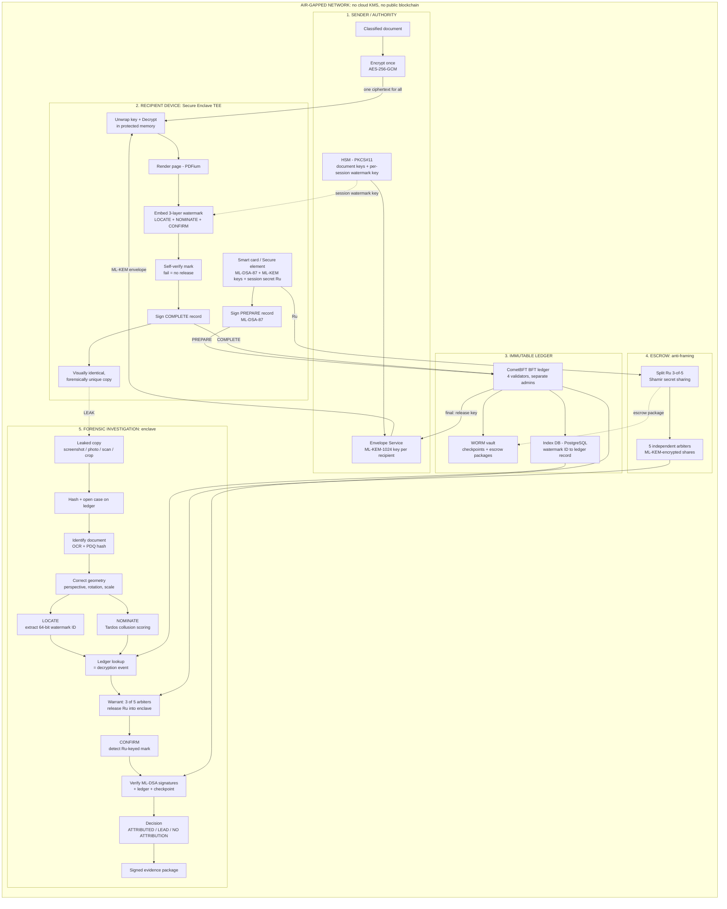

# Architecture

This document describes the SAAKSHI design. Nothing described here is implemented yet; see [ROADMAP.md](ROADMAP.md) for the planned build order.

## Zones

### 1. Sender / Authority

The document is encrypted once with AES-256-GCM, so one ciphertext serves every recipient. Document keys and a fresh per-session watermark key are held in an HSM (PKCS#11). An envelope service wraps the document key for each recipient with ML-KEM-1024, and releases it only after the ledger confirms the recipient's signed PREPARE record.

### 2. Recipient device (secure enclave)

The recipient's smart card or secure element holds the ML-DSA-87 and ML-KEM keys and a session secret, Ru. The device signs a PREPARE record, unwraps the key and decrypts in protected memory, renders the page, and embeds the three-layer watermark. It then self-verifies the mark (failure means no release) and signs a COMPLETE record. The result looks identical to other copies but is forensically unique.

### 3. Immutable ledger

A CometBFT ledger with 4 validators under separate administrators stores PREPARE and COMPLETE records. A write-once (WORM) vault holds ledger checkpoints and escrow packages. An index database maps a watermark ID to its ledger record.

### 4. Escrow (anti-framing)

Ru is split 3-of-5 with Shamir secret sharing. Each share is encrypted with ML-KEM to one of 5 independent arbiters. The escrow package is stored in the WORM vault. No single party, including an administrator, can reconstruct Ru.

### 5. Forensic investigation (enclave)

Investigators work inside an enclave on a leaked screenshot, photo, scan or crop. The pipeline identifies the document, corrects geometry, extracts the watermark, looks up the decryption event, and, under warrant, obtains Ru from 3 of 5 arbiters to check the CONFIRM layer. It verifies signatures, ledger inclusion and checkpoint, and outputs a decision and a signed evidence package.

## Release flow

Mapped to the PS 26237 end-to-end workflow:

1. **Encrypt and distribute.** The authority encrypts the document once and distributes the single ciphertext.
2. **Decrypt request.** The recipient's device requests the key and signs a PREPARE record with ML-DSA-87.
3. **Commit to ledger.** The PREPARE record is committed to the BFT ledger; once final, the envelope service releases the ML-KEM-wrapped key. No record, no plaintext.
4. **Decrypt.** The device unwraps the key and decrypts in protected memory.
5. **Watermark.** The page is rendered and the three-layer watermark is embedded using the per-session key; the device self-verifies the mark.
6. **Sign.** The device signs a COMPLETE record.
7. **Commit COMPLETE.** The COMPLETE record is committed to the ledger and indexed by watermark ID; Ru is escrowed 3-of-5.
8. **Copy delivered.** The recipient views a visually identical, forensically unique copy.
9. **Leak, extract and match.** When a copy leaks, the watermark ID is extracted and matched on the ledger to a decryption event.
10. **Verify and evidence record.** Signatures, ledger proof and checkpoint are verified, and a signed evidence package is produced.

## Investigation flow

1. Hash the leaked file and open a case on the ledger.
2. Identify the source document (OCR and PDQ hash).
3. Correct perspective, rotation and scale using the keyed sync pattern.
4. LOCATE: extract the 64-bit watermark ID. NOMINATE: score collusion candidates (Tardos code).
5. Look up the watermark ID on the ledger to find the decryption event.
6. Under warrant, 3 of 5 arbiters release Ru into the enclave.
7. CONFIRM: detect the Ru-keyed mark.
8. Verify ML-DSA signatures, ledger records and checkpoint.
9. Decide: ATTRIBUTED, LEAD or NO ATTRIBUTION. A decryption event is named only when every check passes.
10. Produce the signed evidence package.

## Trust boundaries

- Plaintext exists only inside the recipient enclave.
- Recipient keys are non-exportable.
- The ledger stores hashes and signatures only, never documents or keys.
- No single administrator can alter ledger records or forge evidence against a recipient.

## Air-gap

The whole system runs on an isolated network. It uses no cloud key-management service and no public blockchain.
