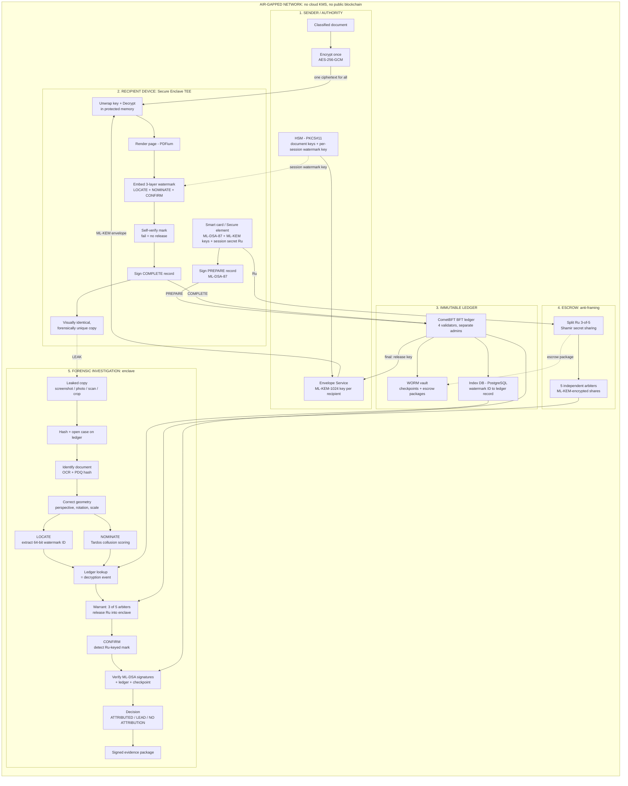

# Architecture

SAAKSHI runs entirely inside an air-gapped network. The design is complete; nothing shown here is implemented yet.

## Zones

**1. Sender / authority.** The classified document is encrypted once with AES-256-GCM, so every recipient receives the same ciphertext. Document keys and a fresh per-session watermark key are held in an HSM (PKCS#11). The Envelope Service wraps the document key for each recipient with ML-KEM-1024, and releases it only after the ledger has finalised the recipient's signed record.

**2. Recipient device.** Keys live on a smart card or secure element and are non-exportable. Inside a secure enclave the device signs a PREPARE record, unwraps the key, decrypts in protected memory and renders the page. The three-layer watermark is embedded during rendering and self-verified; if verification fails, nothing is released. The device then signs a COMPLETE record. The resulting copy is visually identical to others but forensically unique.

**3. Immutable ledger.** A CometBFT ledger with 4 validators under separate administrators stores signed records. A write-once (WORM) vault holds ledger checkpoints and escrow packages, and a PostgreSQL index maps each watermark ID to its ledger record. The ledger stores hashes and signatures only.

**4. Escrow (anti-framing).** The recipient's session secret (Ru) is split 3-of-5 with Shamir secret sharing among 5 independent arbiters, each share encrypted with ML-KEM. No single administrator can reconstruct Ru, so no single administrator can forge the final proof against a recipient.

**5. Forensic investigation.** Inside an enclave, a leaked copy is hashed, the source document is identified, geometry is corrected, and the watermark is extracted and matched to a ledger record. The result is a signed evidence package with a decision of ATTRIBUTED, LEAD or NO ATTRIBUTION.

## Release flow

The ten steps map one-to-one to the PS 26237 end-to-end workflow.

1. **Encrypt and distribute.** The authority encrypts the document once and distributes one ciphertext to all recipients.
2. **Decrypt.** The recipient requests access; the device signs a PREPARE record with ML-DSA-87. Once the ledger has finalised it, the Envelope Service releases the ML-KEM envelope and the enclave unwraps the key and decrypts in protected memory.
3. **Watermark.** The page is rendered and the three-layer watermark (LOCATE, NOMINATE, CONFIRM) is embedded using the per-session watermark key.
4. **Sign.** The enclave self-verifies the mark (on failure nothing is released) and signs a COMPLETE record.
5. **Commit to ledger.** The COMPLETE record is committed to the BFT ledger, and the recipient's escrow package is stored in the WORM vault.
6. **Copy delivered.** The recipient views a visually identical, forensically unique copy.
7. **Extract.** After a leak, the watermark ID is extracted from the leaked copy.
8. **Match on ledger.** The watermark ID is looked up on the ledger to find the decryption event.
9. **Verify.** ML-DSA signatures, ledger proof and checkpoint are verified.
10. **Evidence record.** A signed evidence package is produced.

## Investigation flow

1. Hash the leaked copy and open a case on the ledger.
2. Identify the source document (OCR and PDQ hashing).
3. Correct perspective, rotation and scale using the keyed sync pattern.
4. LOCATE: extract the 64-bit watermark ID and look it up on the ledger to find the decryption event.
5. NOMINATE: score candidates with a Tardos code when colluding recipients are suspected.
6. Under a warrant, 3 of 5 arbiters release Ru into the enclave.
7. CONFIRM: detect the Ru-keyed mark.
8. Verify ML-DSA signatures, ledger inclusion and checkpoint.
9. Decide: ATTRIBUTED only if every check passes; otherwise LEAD or NO ATTRIBUTION.
10. Emit a signed evidence package.

## Trust boundaries

- Plaintext exists only inside the recipient enclave.
- Recipient keys are non-exportable and stay in hardware.
- The ledger stores hashes and signatures only, never documents or keys.
- Ru is never held by a single party; recovering it requires 3 of 5 arbiters and a warrant.

## Air-gap statement

The whole system runs on an isolated network. It uses no cloud KMS, no public blockchain and no external services. Cryptography follows NIST FIPS 203 and FIPS 204, with keys held in on-premise HSMs and recipient hardware.
